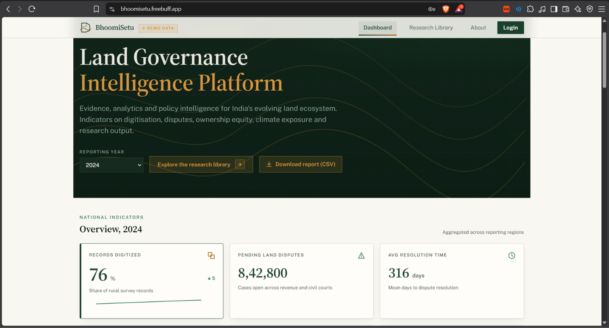
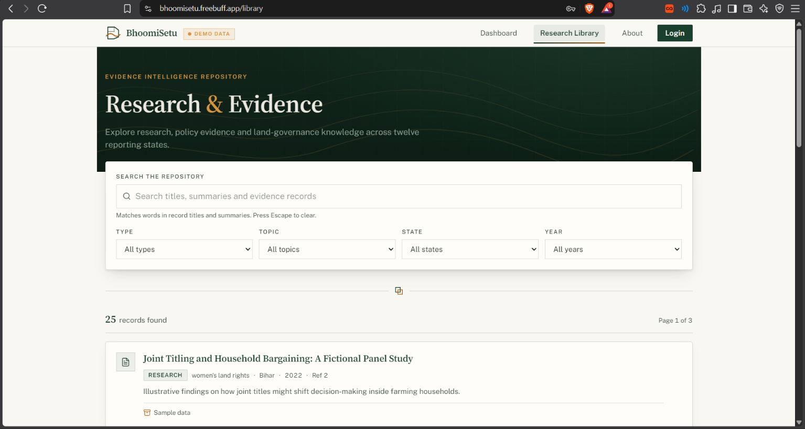
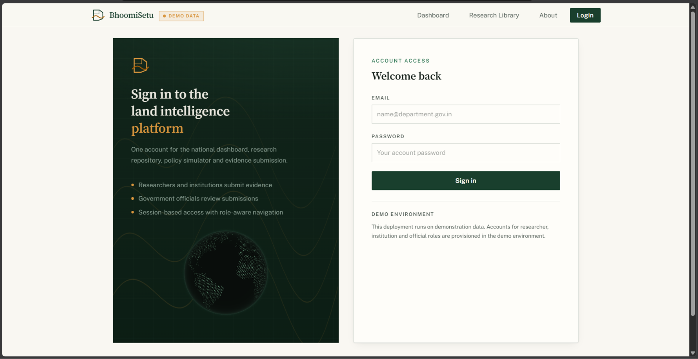
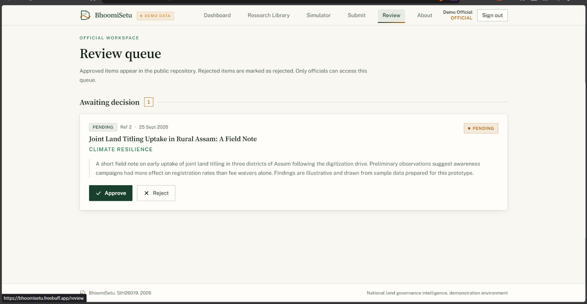
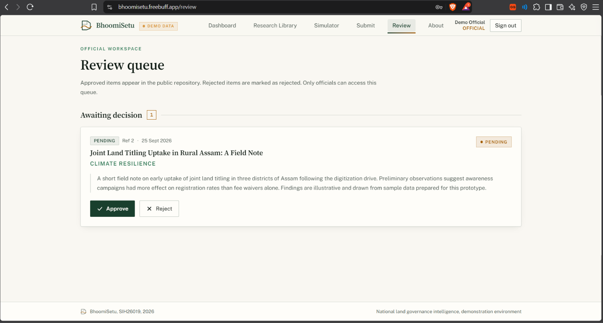
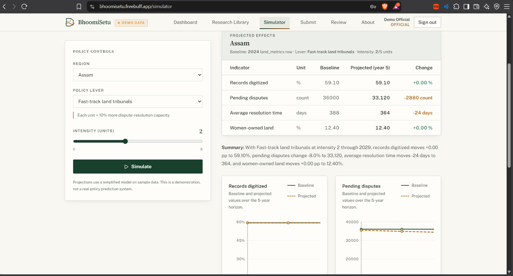
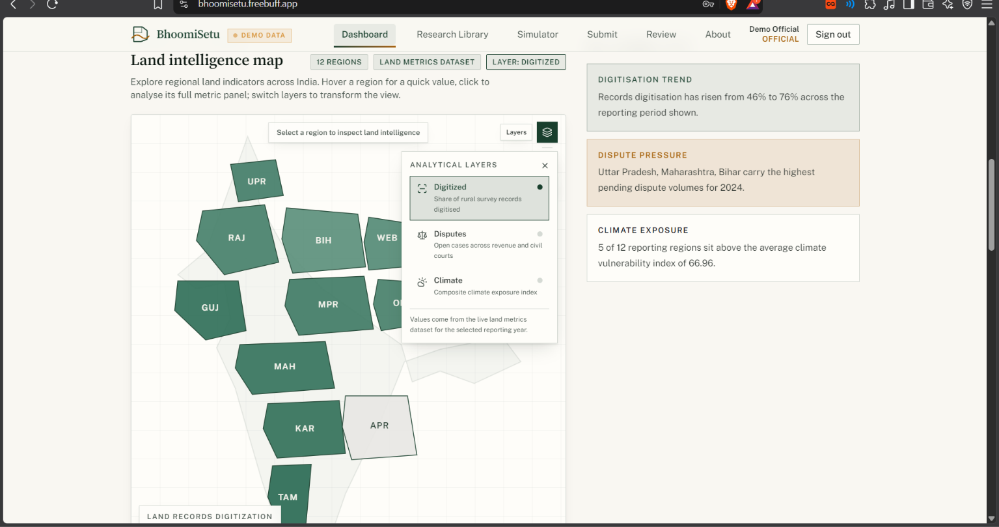

# BhoomiSetu

### National Digital Platform for Research, Policy Innovation, and Evidence-Based Land Governance in India

**Smart India Hackathon 2026 — Problem Statement: SIH26019**

BhoomiSetu is a digital platform designed to bring **land-governance research, regional indicators, evidence submission, policy simulation, and decision-support tools** into one structured environment.

The platform combines a research repository with dashboard-based land indicators, statistical trend forecasting, policy simulation, GIS visualization, and role-based evidence review.

> **Live Demo:** https://bhoomisetu.freebuff.app/

---

## Overview

Land governance involves fragmented research, regional indicators, policy interventions, and evidence from multiple sources. BhoomiSetu provides a unified interface for exploring this information and demonstrating how evidence can move through a structured research-to-policy workflow.

The current deployment uses **demonstration/sample data** to showcase the platform's functionality.

---

## Key Features

### 1. National Land Governance Dashboard

The dashboard provides an overview of important land-governance indicators across reporting regions.

It includes:

* Records digitized
* Pending land disputes
* Average dispute-resolution time
* Women-owned land indicators
* Regional and national-level summaries
* Year-based reporting
* Downloadable CSV reports
* Interactive data visualizations



---

### 2. Research & Evidence Repository

The Research Library provides a searchable repository for land-governance research and evidence records.

Users can:

* Search research titles and summaries
* Filter by research type
* Filter by topic
* Filter by state
* Filter by year
* Browse individual evidence records
* View sample-data indicators
* Navigate through research records



---

### 3. Role-Based Authentication

BhoomiSetu includes a login system with role-aware access.

Supported roles include:

* **Researcher** — access research submission workflows
* **Institution** — contribute research and evidence
* **Official** — review submitted evidence

Authenticated users receive access appropriate to their assigned role.



Demo credentials are **not stored in the public repository**.

---

### 4. Research Submission Workflow

Researchers and institutions can submit new evidence through the submission interface.

The workflow is:

```text
Researcher / Institution
          ↓
     Submit Evidence
          ↓
      Pending Review
          ↓
   Government Official
          ↓
      Approve / Reject
          ↓
 Public Research Repository
```

Submission fields include:

* Research title
* Research type
* Topic
* State/region
* Summary and findings

Submitted records enter the review workflow before becoming part of the public repository.



---

### 5. Official Review Workspace

Government officials have access to a dedicated review workspace.

Officials can:

* View pending submissions
* Inspect research metadata
* Read submitted summaries
* Approve evidence
* Reject evidence

This demonstrates an evidence-validation workflow rather than automatically publishing every submitted record.



---

### 6. Policy Simulator

The policy simulator demonstrates how selected policy interventions could affect land-governance indicators.

Users can select:

* Region
* Policy lever
* Intervention intensity

The simulator displays:

* Baseline values
* Projected values
* Changes in selected indicators
* Five-year projection charts
* A summary of projected effects



> **Note:** The simulator uses a simplified model and demonstration data. Its projections are illustrative and should not be interpreted as official government forecasts.

---

### 7. Statistical Trend Forecast

BhoomiSetu includes a statistical trend-forecasting component for selected indicators.

The forecasting workflow uses historical/sample data and a **linear trend approach** to extend observed values into future years.

The implementation is intentionally transparent and lightweight rather than presenting the output as an AI prediction.

Forecasted indicators include:

* Records digitized percentage
* Pending disputes
* Average resolution days
* Women-owned land percentage
* Climate vulnerability index
* Built-up percentage

The forecasting script is available under:

```text
analytics/forecast.py
```

---

### 8. Interactive GIS Visualization

BhoomiSetu includes an interactive GIS visualization for geographic exploration of land-governance indicators.

The GIS layer complements the dashboard by allowing users to examine regional information spatially.

It is designed to support:

* Region-based visualization
* Geographic exploration
* Land-governance indicators
* Regional comparison
* Map-based interpretation of dashboard data



---

## Technology Stack

| Technology                     | Purpose                                |
| ------------------------------ | -------------------------------------- |
| React 19                       | Frontend application                   |
| TypeScript                     | Type-safe development                  |
| Vite                           | Build tool and development server      |
| TanStack Router                | Application routing                    |
| Tailwind CSS                   | Styling and responsive UI              |
| Supabase                       | Authentication and PostgreSQL database |
| Supabase Auth                  | Authentication                         |
| Supabase RLS                   | Database access control                |
| Recharts / charting components | Data visualization                     |
| Bun                            | Package management and development     |

### Architecture

```text
React + TypeScript
        │
        ├── Dashboard
        ├── Research Library
        ├── GIS Visualization
        ├── Submission
        ├── Review Workspace
        └── Policy Simulator
                │
                ↓
        Supabase Client
                │
        ┌───────┴────────┐
        ↓                ↓
   Supabase Auth     PostgreSQL
                         │
                         ├── Regions
                         ├── Land Metrics
                         ├── Evidence
                         ├── Projects
                         ├── Forecasts
                         ├── Policy Levers
                         ├── Profiles
                         └── Submissions
```

---

## Data & Authentication

The deployed application uses **Supabase** for authentication and application data.

For local development, configure:

```env
VITE_SUPABASE_URL=your_supabase_project_url
VITE_SUPABASE_ANON_KEY=your_supabase_anon_key
```

These values should come from your own Supabase project.

**Never commit your `.env` file or private credentials to GitHub.**

The deployed demonstration environment uses sample/demo data to showcase the platform workflow.

---

## Project Structure

```text
bhumi-vision-hub/
│
├── analytics/
│   └── forecast.py
│
├── public/
│
├── screenshots/
│   ├── dashboard.png
│   ├── login.png
│   ├── research-library.png
│   ├── policy-simulator.png
│   ├── submission.png
│   ├── review.png
│   └── gis-map.png
│
├── src/
│   ├── components/
│   ├── lib/
│   ├── routes/
│   └── ...
│
├── supabase/
│   └── migrations/
│
├── package.json
├── tsconfig.json
├── vite.config.ts
└── README.md
```

---

## Running Locally

### 1. Clone the repository

```bash
git clone https://github.com/manshi-1028/bhumi-vision-hub.git
cd bhumi-vision-hub
```

### 2. Install dependencies

```bash
bun install
```

### 3. Configure environment variables

Create a `.env` file in the project root:

```env
VITE_SUPABASE_URL=your_supabase_project_url
VITE_SUPABASE_ANON_KEY=your_supabase_anon_key
```

### 4. Start the development server

```bash
bun run dev
```

---

## Application Routes

| Route          | Purpose                        | Access                   |
| -------------- | ------------------------------ | ------------------------ |
| `/`            | National dashboard             | Public                   |
| `/library`     | Research & evidence repository | Public                   |
| `/library/:id` | Research record details        | Public                   |
| `/login`       | Authentication                 | Public                   |
| `/simulator`   | Policy simulation              | Authenticated            |
| `/submit`      | Research submission            | Researcher / Institution |
| `/review`      | Evidence review                | Official                 |
| `/about`       | Project information            | Public                   |

---

## Demo Environment

The deployed application is a **demonstration environment**.

The dashboard and repository contain demonstration/sample records.

Demo accounts for the available roles are provisioned separately. For security and repository hygiene, credentials are **not published in this README**.

---

## Current Scope

### Implemented

* National land-governance dashboard
* Regional indicators
* Research and evidence repository
* Search and filtering
* Role-based authentication
* Research submission workflow
* Official review workflow
* Policy simulator
* Statistical trend forecasting
* CSV report generation
* Interactive GIS visualization
* Responsive interface
* Demonstration data environment

### Future Expansion

* Larger evidence datasets
* Additional land-governance indicators
* Expanded GIS layers
* More advanced analytical models
* Additional research and policy workflows
* Production-scale data integration

---

## Design Principles

BhoomiSetu follows an institutional visual language focused on:

* Clear information hierarchy
* Evidence-first presentation
* Readable data visualization
* Minimal visual noise
* Responsive layouts
* Accessible interaction
* Consistent green, off-white, and amber visual system

The interface is designed as a research and governance platform rather than a consumer-facing application.

---

## Problem Statement

**SIH26019 — National Digital Platform for Research, Policy Innovation, and Evidence-Based Land Governance in India**

BhoomiSetu demonstrates a unified digital workflow for discovering land-governance evidence, examining regional indicators, modelling policy scenarios, forecasting statistical trends, exploring geographic information, and managing evidence submissions through a role-based review process.

---

## Deployment

The current demonstration deployment is hosted at:

**https://bhoomisetu.freebuff.app/**

Freebuff is the deployment/hosting environment and is therefore listed under deployment rather than the core application technology stack.

---

## Repository

**GitHub:**
https://github.com/manshi-1028/bhumi-vision-hub

---

## License

This project was developed as a **Smart India Hackathon 2026 prototype** for Problem Statement **SIH26019**.

Unless a separate license file is added to the repository, the project should be treated as a hackathon demonstration project rather than a production government system.

---

## Team

**BhoomiSetu — Smart India Hackathon 2026**

Developed as a prototype for **SIH2026 Problem Statement SIH26019**.
